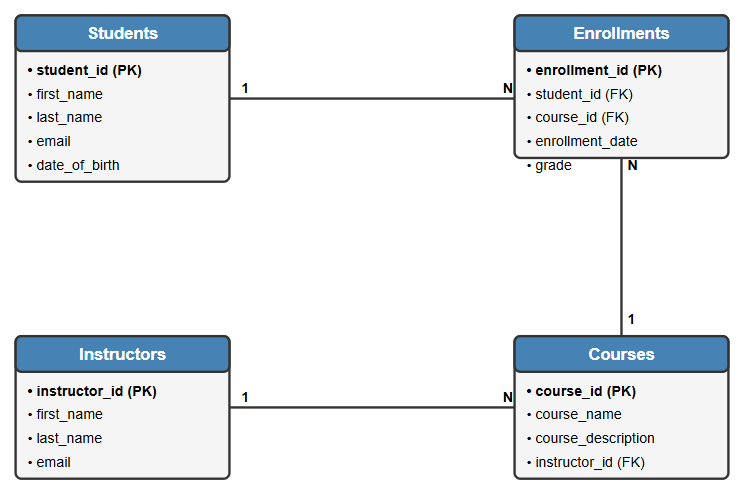
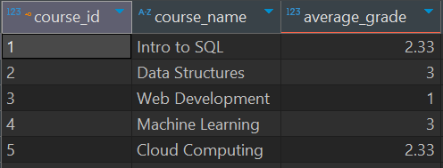
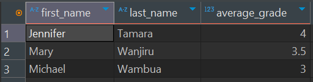
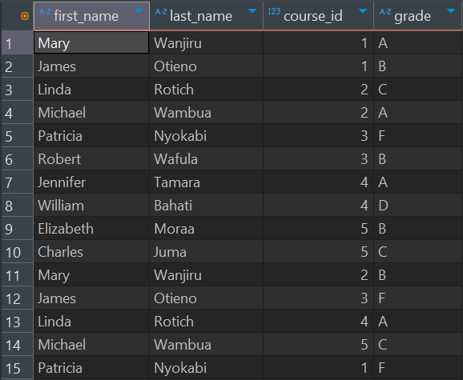
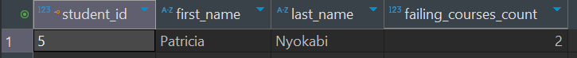

# Student Course Management System

##  Project Overview

This project involves building a **Student Course Management System**. The project involves designing the database schema, populating it with sample data, and writing SQL queries for data analysis. The system allows tracking of students, instructors, courses, and enrollments, and includes advanced querying capabilities for meaningful insights.

---

##  Entity Relationship Diagram (ERD)

  

---

## Instructions to Run the SQL Code

1. Create a new SQL database named `course_management`.
   ```sql
   CREATE DATABASE course_management;
   USE course_management;
   ```

2. Create the following tables with appropriate keys and constraints:
   - `Students`
   - `Instructors`
   - `Courses`
   - `Enrollments`

3. Insert sample data into the tables:
   - At least 10 students
   - 3 instructors
   - 5 courses
   - 15 enrollments (with a mix of grades A–F)

4. Execute the provided SQL queries to test the functionality.

---

## Explanation of the Schema

### Students
- `student_id` (INT, Primary Key)
- `first_name` (VARCHAR)
- `last_name` (VARCHAR)
- `email` (VARCHAR)
- `date_of_birth` (DATE)

### Instructors
- `instructor_id` (INT, Primary Key)
- `first_name` (VARCHAR)
- `last_name` (VARCHAR)
- `email` (VARCHAR)

### Courses
- `course_id` (INT, Primary Key)
- `course_name` (VARCHAR)
- `course_description` (TEXT)
- `instructor_id` (INT, Foreign Key → Instructors)

### Enrollments
- `enrollment_id` (INT, Primary Key)
- `student_id` (INT, Foreign Key → Students)
- `course_id` (INT, Foreign Key → Courses)
- `enrollment_date` (DATE)
- `grade` (CHAR(1))

---

##  Descriptions of Key Queries

- **Students who enrolled in at least one course** – Join `Students` and `Enrollments` to find participating students.
- **Students enrolled in more than two courses** – Use `GROUP BY` and `HAVING` to filter students based on course count.
- **Courses with total enrolled students** – Join `Courses` and `Enrollments`, then use `COUNT`.
- **Average grade per course** – Map grades (A–F) to numeric values and compute averages.
- **Students who haven’t enrolled in any course** – Use a `LEFT JOIN` and `IS NULL` condition.
- **Students with their average grade across all courses** – Aggregate each student’s grades using `AVG`.
- **Instructors with the number of courses they teach** – Join `Instructors` and `Courses`, grouped by instructor.
- **Students enrolled in a course taught by “John Kimani”** – Join across all tables to match instructor name.
- **Top 3 students by average grade** – Aggregate grades and use `ORDER BY` with `LIMIT`.
- **Students failing (grade = 'F') in more than one course** – Use `WHERE` and `HAVING` with `COUNT`.

---

## Sample Output Descriptions
- **Average Grade per Course**:
  
- **Top 3 Students**:
  
- **Student Course Summary View**:
  
- **Failing Students**:
  

---

##  Advanced SQL Features

- **View**:
  - `student_course_summary`: A view that combines student names, course IDs, and grades for simplified reporting.

- **Index**:
  - `idx_enrollments_student_id`: Improves lookup performance on the `student_id` column in `Enrollments`.

---

## Challenges and Lessons Learned

- Learned how to design and normalize relational schemas for real-world systems.
- Practiced using aggregate functions and conditional logic in SQL.
- Reinforced the use of joins, subqueries, and indexing for query optimization.
- Gained experience in documenting SQL projects effectively for collaboration and GitHub hosting.
---

## Conclusion

This project provided hands-on experience in building and querying a relational database from scratch. By simulating a course management system, I strengthened my SQL fundamentals and built a foundation for more complex data engineering and analytics work.

---
